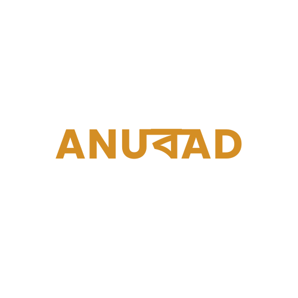

# Anubaad a Translation_Application for Assamese Language
## Powered by NLLB-200 transformer model from META-AI




[](https://opensource.org/licenses/MIT)
[](https://github.com/abinashbordoloi/Anubaad_Translation_Application-NLLB-200-META/graphs/contributors)
[](https://github.com/abinashbordoloi/Anubaad_Translation_Application-NLLB-200-META/issues)
[](https://github.com/abinashbordoloi/Anubaad_Translation_Application-NLLB-200-META/network/members)
[](https://github.com/abinashbordoloi/Anubaad_Translation_Application-NLLB-200-META/stargazers)


Anubad is an application that simplifies language translation tasks, enabling users to effortlessly translate text between multiple languages.

## Table of Contents

- [Features](#features)
- [Installation](#installation)
- [Usage](#usage)
- [Contributing](#contributing)
- [License](#license)

## Features

- **Simple Translation**: Enter text in one language and get the translated text in Assamese.
- **Multilingual Support**: Supports translation between a wide range of languages.
- **Supports Easy OCR Translation**: Extract text from images, files, or photos using OCR and translate to Assamese.
- **User-Friendly Interface**: Intuitive design for easy navigation and usage.
- **Offline Mode**: Save favorite translations for offline access.
- **History**: View translation history for reference.

## Installation

To use Anubad, follow these steps:

1. Clone this repository.
    ```bash
    git@github.com:abinashbordoloi/Anubaad_Translation_Application-NLLB-200-META.git
    ```

2. Install dependencies.
    ```bash
    cd repo-name/app
    npm install or npx install
    ```

3. Start the application.
    ```bash
    npx expo start or npm install
    ```
4. To run the application on your phone
   Install the ExpoGo application on your phone and scan the QR code generated by the metro build.

## Backend Configuration

1. Run the application backend( Flask Backend) 
```bash
cd repo-name/backend
python server.py
```

2. Check the port that is running on
   match the API request endpoint with  the backend in the frontend part of the application under app/config translate.js.
   

## Usage

1. Open the Anubad application on your device.
2. Enter text in the source language.
3. Select the source language for translation to Assamese.
4. View the translated text.
5. Extract text using the phone camera for translation

## Contributing

We welcome contributions from the community! To contribute:

1. Fork the repository.
2. Create a new branch (`git checkout -b feature/awesome-feature`).
3. Make modifications and commit changes (`git commit -am 'Add an awesome feature'`).
4. Push to the branch (`git push origin feature/awesome-feature`).
5. Create a Pull Request.

## License

This project is licensed under the [MIT License](https://opensource.org/licenses/MIT) - see the [LICENSE.md](LICENSE.md) file for details.
